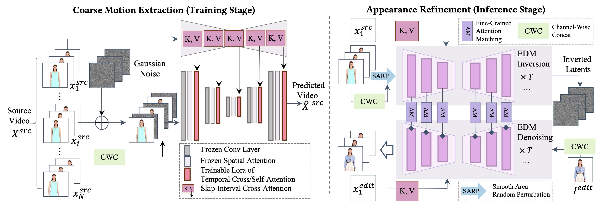

# I2VEdit

Official PyTorch Implementation of SIGGRAPH Asia 2024 Paper "[I2VEdit: First-Frame-Guided Video Editing via Image-to-Video Diffusion Models](https://arxiv.org/abs/2405.16537)".


[](https://arxiv.org/abs/2405.16537)
[](https://github.com/Vicky0522/I2VEdit)

<a href="https://i2vedit.github.io/" target='_blank'>
     </a>

I2VEdit propagates edits from a single frame to the entire video.

https://github.com/user-attachments/assets/d6775baa-78c8-4374-8b6a-92c10c59507a
## 🔥News
* [2024-11-24] Code and pre-trained weights are released!
* [2024-09-12] Our paper is accepted to SIGGRAPH Asia 2024 (Conference Track)!
* [2024-05-26] Our homepage has been established!

## 🔧TODO
- [ ] Gradio interface
- [ ] Optimize time and resource costs
- [x] Release code and weights

## 🧐Methods
Our framework has two pipelines: Coarse Motion Extraction (training) learns motion LoRAs, and Appearance Refinement (inference) refines motion and appearance consistency via fine-grained attention matching during EDM inversion and denoising.

<p align="center">
  
</p>

## 🌿Installation with conda

```
git clone https://github.com/Vicky0522/I2VEdit.git
cd I2VEdit
# install required packages
conda env create -f environment.yml
# install i2vedit
python setup.py develop
```
Our current pipeline is resource-intensive. If you wish to fine-tune motion LoRA to customize your edits, we recommend using a machine equipped with at least one `A100` GPU and `300GB` of disk space. For users without access to a GPU with large memory, you can still edit pre-trained videos using pre-saved motion LoRA and other necessary cached data, requiring approximately `20GB` of GPU memory and `100GB` of disk space (for videos with one chunk). We warmly welcome contributions to enhance resource and time efficiency.

## 🚄Quick Start

### Edit pre-trained videos

1. Choose your preferred [editing samples](#gallery), and click on the links below to download the pre-trained weights for motion LoRAs, intermediate attention maps, inverted latents, source videos, edited first images, and configuration files. Downloading the whole dataset can be time-consuming and require substantial storage space. We recommend downloading only the necessary parts. Here are examples:
```
# login with your huggingface token 
huggingface-cli login

# download motion LoRAs
huggingface-cli download Vicky0522/I2VEdit-pretrained-videos --include "item<item id>/train_motion_lora*" --repo-type=dataset --local-dir <path to your local dir>

# download attention maps and inverted latents
huggingface-cli download Vicky0522/I2VEdit-pretrained-videos --include "item<item id>/attention_store*" --repo-type=dataset --local-dir <path to your local dir>

# download the attention maps saved for skip-interval cross-attention only if they
# are provided and you need to edit multiple chunks. For short videos, editing can be
# performed without skip-interval cross-attention to save time costs.
huggingface-cli download Vicky0522/I2VEdit-pretrained-videos --include "item<item id>/consistency_attention_store*" --repo-type=dataset --local-dir <path to your local dir>

# download the source video and the edited first frames 
huggingface-cli download Vicky0522/I2VEdit-pretrained-videos --include "item<item id>/source_and_edits*" --repo-type=dataset --local-dir <path to your local dir>

# download configuration files
huggingface-cli download Vicky0522/I2VEdit-pretrained-videos --include "item<item id>/*.yaml" --repo-type=dataset --local-dir <path to your local dir>

# download all the necessary data for an item
huggingface-cli download Vicky0522/I2VEdit-pretrained-videos --include "item<item id>/*" --repo-type=dataset --local-dir <path to your local dir>
```
2. Edit the configuration file and update the following parameters to their respective paths:
- `pretrained_model_path`: Path to the pre-trained SVD model, download [here](https://huggingface.co/stabilityai/stable-video-diffusion-img2vid/tree/main).
- `attention_matching_params.lora_dir`: Path to the motion loRAs.
- `attention_matching_params.load_attention_store`: Path to the attention maps and inverted latents.
- `data_params.video_path`: Path to the source video.
- `data_params.keyframe_paths`: Paths to the edited first frames.
- `attention_matching_params.load_consistency_attention_store`: Path to the attention maps saved for skip-interval cross-attention if `use_consistency_attention_control` is enabled.

Once updated, run:
```
CUDA_VISIBLE_DEVICES=<gpu id> python main.py --config <path to your config file>
```
Editing results will be saved under `./outputs/`.

### Customize your edits
1. Find the preferred videos, such as from [Pexels](https://www.pexels.com/videos/). Utilize powerful image editing tools, such as [EditAnything](https://github.com/sail-sg/EditAnything), [AnyDoor](https://github.com/ali-vilab/AnyDoor), [Instruct-Pix2pix](https://github.com/timothybrooks/instruct-pix2pix), [InstantStyle](https://github.com/instantX-research/InstantStyle), [InstantID](https://github.com/instantX-research/InstantID), and [IDM-VTON](https://github.com/yisol/IDM-VTON) to create first-frame edits.
2. Set parameters of the configuration file. An example is provided: `./config/customize_train.yaml`. We also provide details of the key parameters as follows: 
   
| Parameter                 | Description                          |  Note |
| --------------------- | :----------------------------------- | :-----|
| `pretrained_model_path` | Path to the pre-trained svd weights | Change this to your own path. |
| `output_dir` | Where the output folders will be created | Default as `./outputs/`. |
| `use_sarp` | Whether to use smooth area random perturbation (SARP)  | If set to `true`, smooth area random perturbation (SARP) will be enabled. |
| `use_motion_lora` | Whether to use motion LoRA | If set to `true`, motion LoRA will be enabled. |
| `retrain_motion_lora` | Whether to retrain the motion LoRA | If set to `true`, motion LoRA will be retrained and any pre-trained weights will be ignored if provided. |
| `use_inversed_latents` | Whether to use inversed latents as the initial noisy latents for editing | If set to `true`, EDM inversion will be performed to obtain initial latents, otherwise random Gaussian noise will be used |
| `use_attention_matching` | Whether to use attention matching | If set to `true`, attention matching will be used. |
| `use_consistency_attention_control` | Whether to use skip-interval motion LoRA | If set to `true`, skip-interval motion LoRA will be used. This will lead to much more time cost and disk space when editing longer videos. |
| `data_params.video_path` | Path to the source video | |
| `data_params.keyframe_paths` | Paths to the edited first frames | List of paths of edited first frames. |
| `data_params.begin_clip_id` | Clip id to start editing | Use it to specify the starting clip id. This parameter also controls the number of generated clips with `end_clip_id`. |
| `data_params.end_clip_id` | Clip id to end editing | Use it to specify the ending clip id. This parameter also controls the number of generated clips with `begin_clip_id`. |
| `data_params.pad_to_fit` | Whether to pad the source video to achieve a 16:9 aspect ratio. | If the source video has an aspect ratio much different from 16:9, it is recommended to set this value as `true`. It would be better to synchronize this value with `train_motion_lora_params.train_data.pad_to_fit` and `train_motion_lora_params.validation_data.pad_to_fit`. |
| `train_motion_lora_params.lora_rank` | loRA rank | Default as `32`. Reducing this value lowers resource usage but increases the instability of motion preservation. |
| `train_motion_lora_params.train_data.height & weight` | Resolutions for training | Default as `896 & 512`. Increasing this value raises resource usage and the risk of overfitting. |
| `sarp_params.sarp_noise_scale` | Noise scale for SARP | |
| `attention_matching_params.best_checkpoint_index` | Best motion LoRA checkpoint number to use | |
| `attention_matching_params.disk_store` | Whether to store the attention maps to the disk | Currently this value should be `true`, attention maps of one timestep approximately cost 3GB. |
| `attention_matching_params.params.edit<edit id>.temporal_step_thr` | β1\beta_1 and β2\beta_2 for temporal attention injection | [0.5, 0.8] will work for most cases, if not, try [0.4, 0.5]. The order of these parameters should match the sequence of the edited first frames. |

<!-- | `train_motion_lora_only` | Whether to train motion LoRA only without other procedures | If set to `true`, the script will only train motion LoRA and not perform any edits. | -->

3. Run
```
CUDA_VISIBLE_DEVICES=<gpu id> python main.py --config config/customize_train_<your video>.yaml
```

### Save and reuse cached data

The output folder will look like this once running finishes:
```
- outputs
  - i2vedit-xxx
    - train_motion_lora
      - clip_0
      ...
    - attention_store
      - clip_0
      ...
    - consistency_train_attention_store (if use_consistency_attention_control is enabled)
      - clip_0
    - consistency_attention_store (if use_consistency_attention_control is enabled)
      - clip_0
    - consistency_edit_attention_store (if use_consistency_attention_control is enabled)
      - clip_0
    - *.pt
    - *.png
    - *.mp4 
```
#### Reuse data for the same source videos:
👇You can save the following data and reuse them later if editing the same source videos:
- `train_motion_lora`: Set `attention_matching_params.lora_dir` to use motion LoRAs for each clip. If you want to load previously saved LoRA, set `retrain_motion_lora` to `false`.
- `attention_store`: Set `attention_matching_params.load_attention_store` to use attention maps saved for each timestep and the inverted latents. If this path is specified, pre-saved attention maps and inverted latents will be loaded instead of recomputing EDM inversion.
- `consistency_attention_store`: set `attention_matching_params.load_consistency_attention_store` to load this folder. This folder contains attention maps for the first clip of the source video, which is required for skip-interval cross-attention during inference when `use_consistency_attention_control` is enabled.
- `consistency_train_attention_store`: set `attention_matching_params.load_consistency_train_attention_store` to load this folder. This folder contains attention maps for the first clip of resized source videos, which are necessary for training when `use_consistency_attention_control` is enabled.

#### Reuse data for subsequent clips based on previous edits:
👇In some scenarios, you may perform the same edits on subsequent clips given data from edits of previous clips:
- `*.pt`: Set `load_from_last_frames_latents` to use the last frame of the previously edited clip as the initial frame for current editing. Save and reuse this data if the same edits are applied to subsequent clips.
- `consistency_edit_attention_store`: Set `load_from_previous_consistency_edit_controller` to load this folder. It stores attention maps for the first clip of the edited video, which is required for skip-interval cross-attention during inference when `use_consistency_attention_control` is enabled. Save this folder and reuse it for consistent edits on subsequent clips.
- `consistency_attention_store`: Set `load_from_previous_consistency_store_controller` to load this folder. This folder contains attention maps for the first clip of the source video, which is required for skip-interval cross-attention during inference when `use_consistency_attention_control` is enabled. Save this folder and reuse it for subsequent edits.
  *Note: The configuration key for this parameter differs from the one listed above, even though the data is the same. This discrepancy may be optimized in the future.*

An example is provided: `./config/customize_subsequent_edit.yaml`. Set `data_params.begin_clip_id` and `data_params.end_clip_id` to define the starting and ending indices of the clips, respectively.

## 🎨Gallery

| </br> <p align="center">[download link](https://huggingface.co/datasets/Vicky0522/I2VEdit-pretrained-videos/tree/main/item1)</p> | </br> <p align="center">[download link](https://huggingface.co/datasets/Vicky0522/I2VEdit-pretrained-videos/tree/main/item2)</p> |
| :--------------------- | :----------------------------------- |
| </br> <p align="center">[download link](https://huggingface.co/datasets/Vicky0522/I2VEdit-pretrained-videos/tree/main/item3)</p> | </br> <p align="center">[download link](https://huggingface.co/datasets/Vicky0522/I2VEdit-pretrained-videos/tree/main/item4)</p> |
| </br> <p align="center">[download link](https://huggingface.co/datasets/Vicky0522/I2VEdit-pretrained-videos/tree/main/item5)</p> | </br> <p align="center">[download link](https://huggingface.co/datasets/Vicky0522/I2VEdit-pretrained-videos/tree/main/item6)</p> |
| </br> <p align="center">[download link](https://huggingface.co/datasets/Vicky0522/I2VEdit-pretrained-videos/tree/main/item7)</p> | </br> <p align="center">[download link](https://huggingface.co/datasets/Vicky0522/I2VEdit-pretrained-videos/tree/main/item8)</p> |
| </br> <p align="center">[download link](https://huggingface.co/datasets/Vicky0522/I2VEdit-pretrained-videos/tree/main/item9)</p> | </br> <p align="center">[download link](https://huggingface.co/datasets/Vicky0522/I2VEdit-pretrained-videos/tree/main/item10)</p> |
| </br> <p align="center">to be uploaded</p> | </br> <p align="center">to be uploaded</p> |

## ✏️Citation

If our work is helpful for your research, please consider citing: 
```
@article{ouyang2024i2vedit,
  title={I2VEdit: First-Frame-Guided Video Editing via Image-to-Video Diffusion Models},
  author={Ouyang, Wenqi and Dong, Yi and Yang, Lei and Si, Jianlou and Pan, Xingang},
  journal={arXiv preprint arXiv:2405.16537},
  year={2024}
}
```

## 🙏Acknowledgments  
- Our code incorporates components from [MotionDirector](https://github.com/showlab/MotionDirector), [FateZero](https://github.com/ChenyangQiQi/FateZero), and [SVD-Temporal-ControlNet](https://github.com/CiaraStrawberry/svd-temporal-controlnet). We sincerely appreciate their outstanding work!
- Some of the edited first frames are directly sourced from [AnyV2V](https://github.com/TIGER-AI-Lab/AnyV2V). The source videos are from [Pexels Video](https://www.pexels.com/videos/), [UBC Dress](https://vision.cs.ubc.ca/datasets/fashion/), [DAVIS Dataset](https://davischallenge.org/davis2017/code.html#unsupervised), [TikTok Dataset](https://www.yasamin.page/hdnet_tiktok), and [SORA](https://openai.com/index/video-generation-models-as-world-simulators/). Contact us for any copyright concerns.


